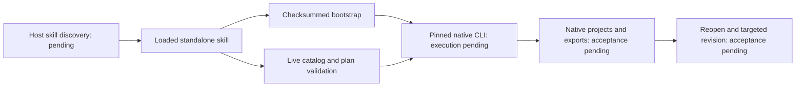

# Local delivery architecture

The independently maintained skills are the source. Each skill includes its own pinned CLI bootstrap, public argv launcher, command catalog gateway and runtime lock. A local plugin snapshot carries checksums for those skill files. It is unpublished; it must not enter the marketplace until source release pinning and host acceptance pass.

PrintCraft supplies JSON Schema. LightCraft and DesignCraft supply parameter guidance text; it must not be promoted to machine-checked schema. Plans execute in one native process. Timeouts remain unknown and never trigger automatic replay. Zero exit requires artifact inspection and creative review. Installation, host discovery, model selection and final output are separate acceptance gates.

The [OpenSpec optimization change](../openspec/changes/harden-designcraft-skill-workflows/proposal.md) is specified and validated, with implementation tasks still open. The development candidate is available from the public [GitHub repository](https://github.com/full-aigc-skills/designcraft-skills) on `main`; no version tag, GitHub Release or marketplace release exists. Native installation has not been run and requires applicable authorization. Existing five plugin specifications remain authoritative for their domains; shared ArtCraft integration for these three domains is still pending.

Runtime preflight now binds the release tag and archive name to the locked binary identity and version, rejecting mismatches before runtime creation. The pinned releases remain 0.2.1.
